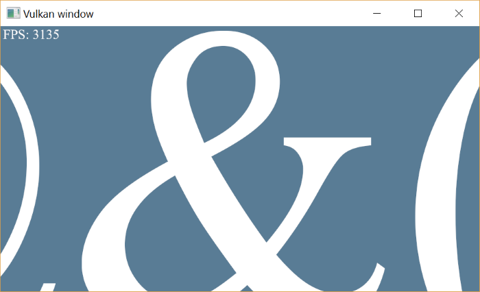

# Lorem ipsum font demo

This repository contains a Vulkan demo of the font renderer I made, an explanation of how it works can be found [here](howitworks.md).

## Building the project

### Windows

I used Visual Studio to make this project. To build it, you need to download and set the correct include and library directories to the dependencies: FreeType, GLFW, Vulkan SDK.

### Linux

I haven't tried to build it on Linux, but it shouldn't be very hard because no platform specific stuff has been used, except the path to the system font directory.
