# Introduction

Sometimes texts needs to be constantly transformed. Fonts with texture atlases become blurry when it is scaled or rotated, because one pixel in the atlas is no longer related to exactly one pixel on the screen. I know two solutions to this:

 * You may rerasterize the glyph every frame to match the current transformation. [Pathfinder](http://pcwalton.github.io/blog/2017/02/14/pathfinder/) has a good performance so rerasterizing every frame may be possible with it.
 * Using signed distance field fonts, but it has the rounded corners problem.

I tried to make a font renderer that is not based on a texture atlas, the fragment shader works from the vector data and it estimates the signed distance to the glyph outline for anti-aliasing. This will be slower than using a texture atlas, but it's not as slow as I thought: I get around 1000 FPS on Radeon HD 7770 in full HD.

# Signed distance estimation

## Line

The following GLSL function calculates the signed distance to a line:

~~~glsl
float dist_to_line(vec2 a, vec2 b, vec2 p)
{
	vec2 dir = b - a;
	vec2 norm = vec2(-dir.y, dir.x);
	return dot(normalize(norm), a - p);
}
~~~

The `a` and `b` parameters are the start and end points of the line, `p` is the coordinate of the current fragment. `dist_to_line` determines the signed distance of `p` to the line, if it's on the right side of the line, it will be positive, if it's on the left side, it will be negative. Positive values are drawn with white and negative values are black:

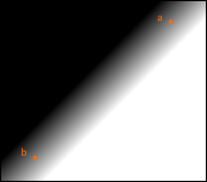 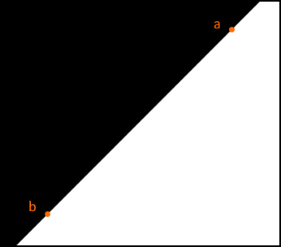

The image can be made sharp by multiplying the signed distance with `in_sharpness`, this variable depends on the zoom level. Its value is exactly as large to make the transition 1 pixel wide and it gives the anti-aliasing effect:

~~~glsl
float alpha = clamp(v * in_sharpness + 0.5, 0.0, 1.0);
out_color = vec4(1.0, 1.0, 1.0, alpha);
~~~

`0.5` is added to the result because `alpha` has to be `0.5` when the pixel is exactly on the line, where the signed distance is zero

To change which side is white/positive, the start and end points of the line can be switched.

## Bezier

A quadratic bezier has three control points: `p0`, `p1`, `p2`. The bezier's parametric function is made up of these control points and a `t` parameter:

(The basics of beziers can be found on [Wikipedia](https://en.wikipedia.org/wiki/B%C3%A9zier_curve) or [here](https://pomax.github.io/bezierinfo/))

We want to estimate the signed distance from this bezier to the `p` point (without index), this requires the `t` parameter. I projected `p` onto the `p0 p2` line, this new point on the line is `p'`, and then I calculated the relative distance to `p0`. If `p'` is the same point as `p0`, `t` will be zero and if it's the same point as `p2`, `t` will be one. In other words, `t` is a ratio tells how far is `p'` along the `p0 p2` line.

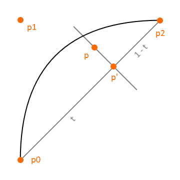

This is the GLSL function to calculate `t`:

~~~glsl
float calc_t(vec2 a, vec2 b, vec2 p)
{
	vec2 dir = b - a;
	float t = dot(p - a, dir) / dot(dir, dir);
	return clamp(t, 0.0, 1.0);
}
~~~

I use this `t` to calculate a tagent line that goes from `q0` to `q1`, and we can calculate a signed distance from this line:

~~~glsl
float dist_to_bezier2(vec2 p0, vec2 p1, vec2 p2, vec2 p)
{
	float t = calc_t(p0, p2, p);
	vec2 q0 = mix(p0, p1, t);
	vec2 q1 = mix(p1, p2, t);
	return dist_to_line(q0, q1, p);
}
~~~

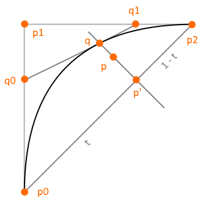 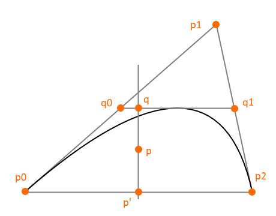

The `q` point is the intersection of the `p p'` line and the `q0 q1` line. The signed distance will be zero at  `q`. This point should be on the black bezier line if this approximation were correct. On the right picture it is not on the bezier. The difference can be hardly seen in the font renderer, because beziers are small in a glyph outline and they rather look like the one on the left picture. To improve precision, beziers can be subdivided or a function can be applied to `t` in the future.

This is the rendered bezier:

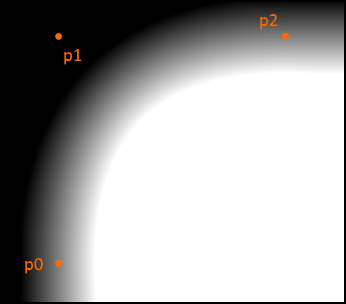 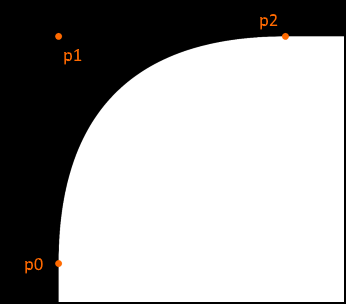

Cubic beziers can be drawn similary, but TrueType only contains quadratic beziers, so I don't support them currently.

~~~glsl
float dist_to_bezier3(vec2 p0, vec2 p1, vec2 p2, vec2 p3, vec2 p)
{
	float t = calc_t(p0, p3, p);
	vec2 q0 = mix(p0, p1, t);
	vec2 q1 = mix(p1, p2, t);
	vec2 q2 = mix(p2, p3, t);
	vec2 r0 = mix(q0, q1, t);
	vec2 r1 = mix(q1, q2, t);
	return dist_to_line(r0, r1, p);
}
~~~

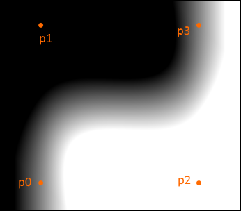 

# Connecting lines and beziers

## Lines with `min` and `max`

Two lines can be combined using `min` and `max` functions, whose parameters are the signed distances of both lines:

~~~glsl
float line0 = dist_to_line(p0, p1, p);
float line1 = dist_to_line(p1, p2, p);
return min(line0, line1);
~~~

On the first picture below, the lines are blended together. If the pixel is black, it's on the left side of both line, if it's white it's on the right side of both lines, if it's grey, it's on the right side of one the lines and it's on the left side of the other line. The `min` function will give the intersection of the white areas and the result is on the second picture:

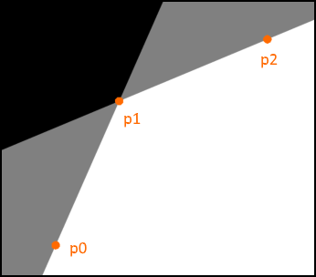 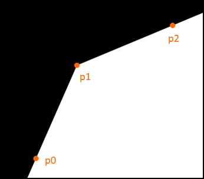

The `min` function only works when the lines are turning right, when the `p2` point is on the right side of the `p0 p1` line. If we try to use `min` on lines that are turning left, the `p0` and `p2` points would be on a black area:

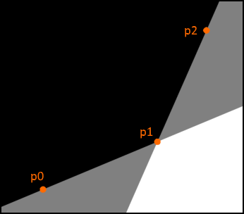 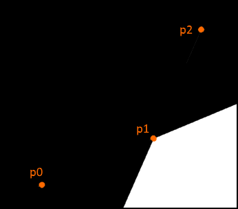

If the lines are turning left, the `max` function should be used, it will give the union of the two lines, turning the grey area white:

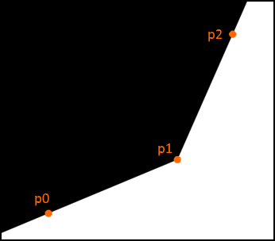

These functions are not limited to two lines. We can draw convex shapes where the points are in clockwise order. `max` can be used to draw inverted convex shapes where the points are in CCW order. In both cases, the white area is on the right side of the edges.

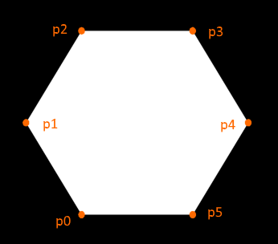 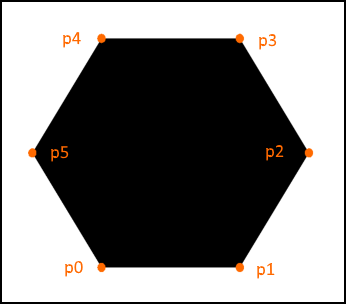

GLSL example for the white hexagon:

~~~glsl
float line0 = dist_to_line(p0, p1, p);
float line1 = dist_to_line(p1, p2, p);
float line2 = dist_to_line(p2, p3, p);
float line3 = dist_to_line(p3, p4, p);
float line4 = dist_to_line(p4, p5, p);
float line5 = dist_to_line(p5, p0, p);
return min(line0, min(line1, min(line2, min(line3, min(line4, line5)))));
~~~

Actually any shape can be achieved by mixing `min` and `max`, but it's not practical and it doesn't work for beziers, but it will help removing rendering artifacts later.

## The closest bezier

The idea is to use the signed distance of the bezier that is the closest for the current pixel. To determinine which is the closest, we need to calculate the unsigned distance:

~~~glsl
float t = calc_t(a, b, p);
float udist = distance(mix(a, b, t), p);
~~~

This will be fast, because it's branchless and `t` will be reused for beziers. Since `t` is from zero to one, it will give the unsigned distance to a line segment:

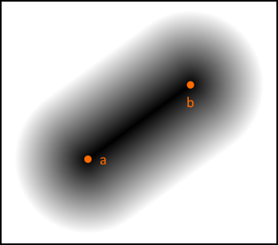

The next example calculates `udist0` and `udist1` to determinine which is the closest bezier, and it uses `bez0` or `bez1` depending on the result:

~~~glsl
float t0 = calc_t(p0, p2, p);
float t1 = calc_t(p2, p4, p);

float udist0 = distance(mix(p0, p2, t0), p);
float udist1 = distance(mix(p2, p4, t1), p);

float bez0 = dist_to_bezier2(p0, p1, p2, t0, p);
float bez1 = dist_to_bezier2(p2, p3, p4, t1, p);
return udist0 < udist1 ? bez0 : bez1;
~~~

`dist_to_bezier2` is modified to take `t` as a parameter:

~~~glsl
float dist_to_bezier2(vec2 p0, vec2 p1, vec2 p2, float t, vec2 p)
{
	vec2 q0 = mix(p0, p1, t);
	vec2 q1 = mix(p1, p2, t);
	return dist_to_line(q0, q1, p);
}
~~~

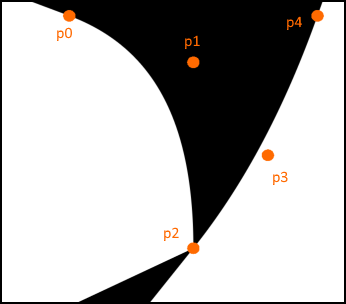 

There is an error under the `p2` point. When `udist0` and `udist1` are equal, it cannot decide whether to use `bez0` or `bez1`. The area where the unsigned distances are equal is painted with purple. We need to add a condition for it:

~~~glsl
#define UDIST_BIAS 0.001

float t0 = calc_t(p0, p2, p);
float t1 = calc_t(p2, p4, p);

float udist0 = distance(mix(p0, p2, t0), p);
float udist1 = distance(mix(p2, p4, t1), p);

float bez0 = dist_to_bezier2(p0, p1, p2, t0, p);
float bez1 = dist_to_bezier2(p2, p3, p4, t1, p);

if (abs(udist0 - udist1) <= UDIST_BIAS)
	return max(bez0, bez1);
else return udist0 < udist1 ? bez0 : bez1;
~~~

I use the `max` function to combine them, because `p4` is on the left side of the `p0 p2` line, so it's considered as a left turn. The `abs(udist0 - udist1) <= UDIST_BIAS` condition checks if the unsigned distances are almost equal, it removes the strange black line on the left picture:

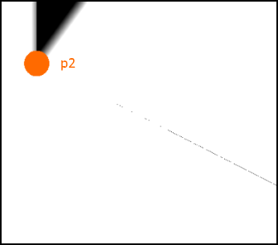 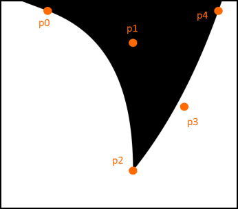

# Drawing letters

## Bezier loops

I only use quadratic beziers in the font rendering demo. I don't use cubic beziers because most fonts only contain quadratic beziers and I don't use lines, because they can be represented by a bezier. We need to store the outline points of the glyph in an array, using only quadratic beziers simplifies things:

~~~
p0    p1    p2    p3    p4    p5    p6    p7    p8  ....
|-----------|-----------|-----------|-----------|
   bezier0     bezier1     bezier2     bezier3
~~~

A bezier always starts and ends at an even point, and all odd points are off-curve control points.

The next picture shows a part of the 'y' character in Times New Roman. All lines have been converted to beziers:

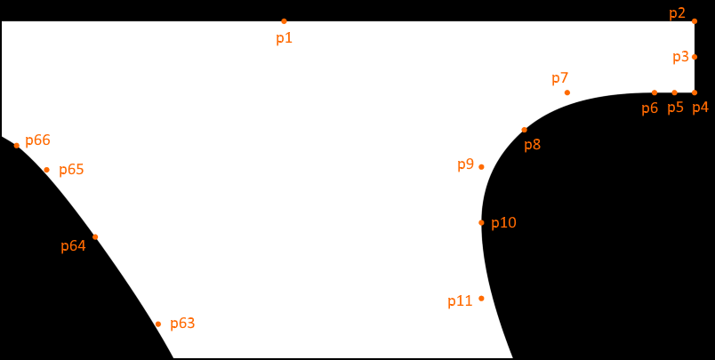

`process_bezier2` will be called for every bezier in the outline. Its parameters are:
* `p`: The current pixel's coordinate
* `i`: Index to the points array where the current bezier starts.
* `min_udist`: The minimum unsigned distance so far. The current bezier will be only processed if it's closer than this value.
* `v`: Signed distance corresponding to the closest bezier.

~~~glsl
void process_bezier2(vec2 p, uint i, inout float min_udist, inout float v)
{
	vec2 p0 = point_buffer.points[i];
	vec2 p1 = point_buffer.points[i + 1];
	vec2 p2 = point_buffer.points[i + 2];

	float t = calc_t(p0, p2, p);
	float udist = distance(mix(p0, p2, t), p);

	if (udist <= min_udist + UDIST_BIAS)
	{
		float bez = dist_to_bezier2(p0, p1, p2, t, p);

		if (udist >= min_udist - UDIST_BIAS)
		{
			vec2 prevp = point_buffer.points[i - 2];
			float prevd = dist_to_line(p0, p2, prevp);
			v = mix(min(bez, v), max(bez, v), step(prevd, 0.0));
		}
		else
		{
			v = bez;
		}

		min_udist = min(min_udist, udist);
	}
}
~~~

It reads the bezier into the `p0`, `p1` and `p2` variables and it calculates the unsigned distance `udist`.

~~~glsl
if (udist <= min_udist + UDIST_BIAS)
~~~

This condition checks if the current bezier is closer than the old, if it's closer then it will overwrite the old bezier with the current one by changing `v` and `min_udist`.

~~~glsl
if (udist >= min_udist - UDIST_BIAS)
~~~

The second condition detects the areas where the unsigned distances are equal. If they are equal, it uses `min` or `max`, that depends on whether the line is turning left or right.

~~~glsl
vec2 prevp = point_buffer.points[i - 2];
float prevd = dist_to_line(p0, p2, prevp);
v = mix(min(bez, v), max(bez, v), step(prevd, 0.0));
~~~

This code chooses `min` or `max` based on whether `prevp` is on the left or right side of the `p0 p2` line:

| Side of the line | prevd    | step(prevd, 0.0) | v             |
|:----------------:|:--------:|:----------------:|:-------------:|
| left             | negative | 0.0              | `min(bez, v)` |
| right            | positive | 1.0              | `max(bez, v)` |

`process_bezier2_loop` goes through beziers in a loop, I call a series of edges/beziers a loop. `begin` and `end` have to be even points.

~~~glsl
void process_bezier2_loop(vec2 p, uint begin, uint end, inout float min_udist, inout float v)
{
	for (uint i = begin; i < end; i += 2)
		process_bezier2(p, i, min_udist, v);
}
~~~

## Cells

Going through all beziers in an outline for each pixel whould be really slow. A cell contains indices to the beziers that intersect it, so the fragment shader only goes through the ones that are in the cell.

A cell is a 32 bit uint value, it contains 3 loops of beziers. For each loop it has a bitfield for the first point and the length of the loop. The index of the end point can be calculated from that. Because beziers always start at an even point, we can divide `begin` and `length` by 2, so it can address 512 points in a glyph.

~~~
bit31                                                                                     bit0
x  x  x  x  x  x  x  x  x  x  x  x  x  x  x  x  x  x  x  x  x  x  x  x  x  x  x  x  x  x  x  x
|--------------------|  |--------------------|  |--------------------|  |--|  |-----|  |-----|
        begin0                  begin1                   begin2         len0    len1     len2
        8 bits                  8 bits                   8 bits        2 bits  3 bits   3 bits
~~~

A cell can encode 3 loops of beziers where one of them has a maximum length of 3 and other two can be 7 edges long. This is 17 beziers in total.

The `cell_signed_dist` decomposes a cell and calculates the signed distance at `p`. There are multiple glyphs in the point buffer, the `point_offset` is an index to the beginning of the current glyph that we are drawing.

~~~glsl
float cell_signed_dist(uint point_offset, uint cell, vec2 p)
{
	float min_udist = 1.0 / 0.0;
	float v = -1.0 / 0.0;

	uint len0 = cell & 3;
	uint len1 = (cell >> 2) & 7;
	uint len2 = (cell >> 5) & 7;

	uint begin0 = point_offset + ((cell >> 8) & 0xFF) * 2;
	uint begin1 = point_offset + ((cell >> 16) & 0xFF) * 2;
	uint begin2 = point_offset + ((cell >> 24) & 0xFF) * 2;

	uint end0 = begin0 + len0 * 2;
	uint end1 = begin1 + len1 * 2;
	uint end2 = begin2 + len2 * 2;

	process_bezier2_loop(p, begin0, end0, min_udist, v);
	process_bezier2_loop(p, begin1, end1, min_udist, v);
	process_bezier2_loop(p, begin2, end2, min_udist, v);

	return v;
}
~~~

There are a lot of bitwise operation, they can be vectorized, but it is not as readable and I only measured a small difference in performance:

~~~glsl
float cell_signed_dist(uint point_offset, uint cell, vec2 p)
{
	float min_udist = 1.0 / 0.0;
	float v = -1.0 / 0.0;

	uvec3 vcell = uvec3(cell, cell, cell);
	uvec3 len = (vcell >> uvec3(0, 2, 5)) & uvec3(3, 7, 7);
	uvec3 begin = point_offset + ((vcell >> uvec3(8, 16, 24)) & 0xFF) * 2;
	uvec3 end = begin + len * 2;

	process_bezier2_loop(p, begin.x, end.x, min_udist, v);
	process_bezier2_loop(p, begin.y, end.y, min_udist, v);
	process_bezier2_loop(p, begin.z, end.z, min_udist, v);

	return v;
}
~~~

And finally the `main` function. It searches the cell for the current pixel and outputs a color value for the signed distance `v`:

~~~glsl
void main()
{
	uvec2 c = min(uvec2(in_cell_coord), in_cell_info.zw - 1);
	uint cell_index = in_cell_info.y + in_cell_info.z * c.y + c.x;
	uint cell = cell_buffer.cells[cell_index];

	float v = cell_signed_dist(in_cell_info.x, cell, in_glyph_pos);
	float alpha = clamp(v * in_sharpness + 0.5, 0.0, 1.0);
	out_color = vec4(1.0, 1.0, 1.0, alpha);
}
~~~

# Conclusion

There are also many things to do when preprocessing the glyph. This demo uses FreeType to read and decompose the `.ttf` files. Sometimes you need to subdivide a bezier in the glyph to remove an artifact. If a font contains overlapping shapes, these shapes have to be merged, furtunately Times New Roman doesn't have this. The preprocessing stage of this demo could be improved to display any strange TrueType font.
